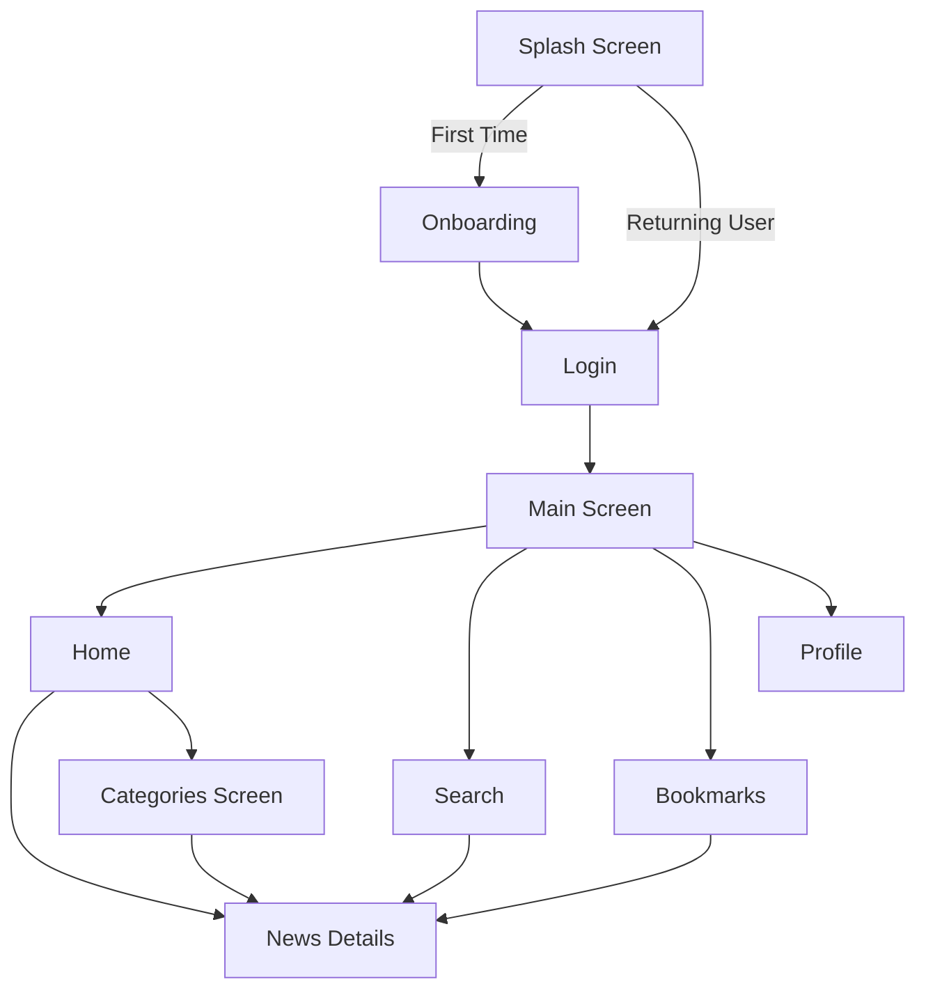

# 📰 NEWST — News App

A modern, feature-rich news application built with **Flutter**, delivering real-time news from around the world using the [NewsAPI](https://newsapi.org). Browse trending headlines, explore categories, search for topics, and bookmark your favorite articles — all in a clean, responsive UI.

---

## ✨ Features

| Feature | Description |
|---|---|
| 🏠 **Home Feed** | Browse top headlines with a horizontal trending carousel and category-filtered news |
| 🔍 **Search** | Real-time search across global news articles |
| 📂 **Categories** | Filter news by 7 categories: Business, Entertainment, General, Health, Science, Sports, Technology |
| 🔖 **Bookmarks** | Save articles locally for offline reading with Hive database |
| 📖 **Article Details** | Read full article details with author info and time-ago formatting |
| 📱 **Onboarding** | 3-page onboarding flow for first-time users with smooth page indicators |
| 🔐 **Auth Screens** | Login & Register UI with form validation and password visibility toggle |
| 🎨 **Material 3** | Modern Material Design 3 theming with custom color palette |
| 📐 **Responsive UI** | Adaptive screen sizing with `flutter_screenutil` |
| ⚡ **Shimmer Loading** | Skeleton loading animations for smooth UX during data fetches |
| 🖼️ **Image Caching** | Efficient network image caching with placeholder and error states |

---

## 📸 Screenshots
Home:

Bookmark:

Search:


---

## 🏗️ Architecture

The project follows a **Feature-Based Architecture** with clean separation of concerns:

```
lib/
├── core/                       # Shared foundation layer
│   ├── constant/               # App-wide constants
│   ├── data/
│   │   ├── local/              # Hive & SharedPreferences helpers
│   │   └── remote/             # API service & configuration
│   ├── enums/                  # Enumerations
│   ├── extensions/             # Dart extensions (DateTime, Navigation)
│   ├── models/                 # Shared data models
│   ├── repos/                  # Repository interfaces & implementations
│   ├── routes/                 # Named routing system
│   ├── theme/                  # Colors, TextStyles, ThemeData
│   └── widgets/                # Reusable UI components
│
├── features/                   # Feature modules
│   ├── Auth/                   # Authentication (Login & Register)
│   ├── bookmark/               # Bookmark management with Hive
│   ├── categories/             # Category browsing
│   ├── home/                   # Home feed with trending & categories
│   ├── main/                   # Main screen with bottom navigation
│   ├── news_details/           # Article detail view
│   ├── onboarding/             # First-launch onboarding
│   ├── search/                 # News search functionality
│   └── splash/                 # Splash screen
│
├── main.dart                   # Entry point
└── news_app.dart               # MaterialApp configuration
```

### Design Patterns

- **Repository Pattern** — Abstracts data sources behind interfaces (`INewsRepository`, `IBookmarkRepo`)
- **BLoC/Cubit Pattern** — State management using `flutter_bloc` with sealed state classes
- **Singleton Pattern** — `HiveHelper` and `SharedPrefsHelper` as factory singletons
- **Interface Segregation** — Abstract classes for API service and repositories for testability

---

## 🛠️ Tech Stack

### Core Framework
| Technology | Purpose |
|---|---|
| [Flutter](https://flutter.dev) `3.38.9` | Cross-platform UI framework |
| [Dart](https://dart.dev) `^3.10.8` | Programming language |
| [Material 3](https://m3.material.io) | Design system |

### State Management
| Package | Purpose |
|---|---|
| [flutter_bloc](https://pub.dev/packages/flutter_bloc) `^9.1.1` | Cubit-based state management |
| [equatable](https://pub.dev/packages/equatable) `^2.0.8` | Value equality for state classes |
| [provider](https://pub.dev/packages/provider) `^6.1.5+1` | Dependency injection & widget-level state |

### Networking
| Package | Purpose |
|---|---|
| [http](https://pub.dev/packages/http) `^1.6.0` | HTTP client for REST API calls |

### Local Storage
| Package | Purpose |
|---|---|
| [hive_ce_flutter](https://pub.dev/packages/hive_ce_flutter) `^2.3.4` | NoSQL database for bookmarks |
| [shared_preferences](https://pub.dev/packages/shared_preferences) `^2.5.4` | Key-value storage (onboarding flag) |

### UI & UX
| Package | Purpose |
|---|---|
| [flutter_screenutil](https://pub.dev/packages/flutter_screenutil) `^5.9.3` | Responsive screen adaptation |
| [cached_network_image](https://pub.dev/packages/cached_network_image) `^3.4.1` | Image caching with placeholders |
| [shimmer](https://pub.dev/packages/shimmer) `^3.0.0` | Skeleton loading effects |
| [smooth_page_indicator](https://pub.dev/packages/smooth_page_indicator) `^2.0.1` | Page indicators for onboarding |

### Dev Tools
| Package | Purpose |
|---|---|
| [flutter_lints](https://pub.dev/packages/flutter_lints) `^6.0.0` | Static analysis rules |
| [hive_ce_generator](https://pub.dev/packages/hive_ce_generator) `^1.11.1` | Code generation for Hive adapters |
| [build_runner](https://pub.dev/packages/build_runner) `^2.11.1` | Code generation tool |
| [FVM](https://fvm.app) | Flutter version management |

---

## 🚀 Getting Started

### Prerequisites

- [Flutter SDK](https://docs.flutter.dev/get-started/install) (3.38.9 recommended)
- [FVM](https://fvm.app/documentation/getting-started/installation) (Optional, for version management)
- A [NewsAPI](https://newsapi.org) key

### Installation

1. **Clone the repository**
   ```bash
   git clone https://github.com/your-username/news-app.git
   cd news-app
   ```

2. **Install the specific Flutter SDK version used in this project**
   ```bash
   fvm install
   ```

3. **Install dependencies**
   ```bash
   fvm flutter pub get
   ```

4. **Generate Hive adapters** (if needed)
   ```bash
   dart run build_runner build --delete-conflicting-outputs
   ```

5. **Run the app**
   ```bash
   fvm flutter run
   ```

### API Configuration

The app uses [NewsAPI](https://newsapi.org) for fetching news articles. The API key is configured in:

```
lib/core/data/remote/api_config.dart
```

> **Note:** For production, consider using environment variables via `--dart-define` to secure your API key.

---

## 📂 App Flow



---

## 🧪 API Endpoints

| Endpoint | Usage |
|---|---|
| `GET /v2/top-headlines` | Fetch trending headlines by category |
| `GET /v2/everything` | Search articles and category-specific news |

---

## 📋 TODO / Roadmap

- [ ] Implement real authentication (Firebase Auth / Custom Backend)
- [ ] Add Dark Mode support
- [ ] Implement pagination (Infinite Scroll)
- [ ] Add pull-to-refresh functionality
- [ ] Implement search debounce
- [ ] Add unit and widget tests
- [ ] Localization (Arabic & English)
- [ ] Build the Profile screen
- [ ] Add Dependency Injection (get_it / injectable)
- [ ] Implement offline mode with cached data
- [ ] Custom app icon and native splash screen
- [ ] Secure API key with environment variables

---

## 🤝 Contributing

Contributions are welcome! Please feel free to submit a Pull Request.

1. Fork the project
2. Create your feature branch (`git checkout -b feature/AmazingFeature`)
3. Commit your changes (`git commit -m 'Add some AmazingFeature'`)
4. Push to the branch (`git push origin feature/AmazingFeature`)
5. Open a Pull Request

---

## 🙏 Acknowledgments

- [NewsAPI](https://newsapi.org) — Free news data provider
- [Flutter](https://flutter.dev) — UI toolkit by Google
- [Bloc Library](https://bloclibrary.dev) — State management
- [Hive](https://pub.dev/packages/hive_ce_flutter) — Lightweight local database

---
